# 🚨 SISTEMA DE MONITOREO Y AUTO-FIX DE ERRORES

> **Sistema completo para detectar, visualizar y corregir errores de build automáticamente**
>
> Última actualización: 22 Enero 2026

Este documento explica el sistema de 3 capas que tenemos para evitar errores como el de `Module not found: './debates.js'`.

---

## 📊 ARQUITECTURA DEL SISTEMA

```
┌─────────────────────────────────────────────────────────────┐
│                    CAPA 1: PREVENCIÓN                       │
│  (Pre-commit hooks + Validación de imports)                │
└─────────────────────────────────────────────────────────────┘
                              ↓
┌─────────────────────────────────────────────────────────────┐
│                   CAPA 2: DETECCIÓN                         │
│  (Build monitoring + Sentry + Agregación)                   │
└─────────────────────────────────────────────────────────────┘
                              ↓
┌─────────────────────────────────────────────────────────────┐
│                   CAPA 3: CORRECCIÓN                        │
│  (Auto-fix scripts + Alerting + Dashboard)                  │
└─────────────────────────────────────────────────────────────┘
```

---

## 1️⃣ CAPA 1: PREVENCIÓN (Pre-commit)

### 🎯 Objetivo
Detectar errores de imports **ANTES** de que lleguen al repositorio.

### 🛠️ Herramientas

#### A) Validador de Imports Automático

**Script:** `scripts/validate-imports.ts`

**Detecta:**
- ✅ Rutas que no existen (`.js` cuando el archivo es `.ts`)
- ✅ Imports de archivos eliminados
- ✅ Case-sensitivity issues (Windows vs. Linux)
- ✅ Imports circulares (futuro)

**Uso manual:**
```bash
# Escanear errores
pnpm validate:imports

# Auto-corregir
pnpm validate:imports:fix
```

**Ejemplo de output:**
```
======================================================================
IMPORT VALIDATION
======================================================================

ℹ Scanning packages for import errors...

ℹ Checking packages/db/src...
ℹ Checking packages/api/src...

======================================================================
RESULTS
======================================================================

ℹ Files checked: 124
ℹ Imports checked: 1,847
✗ Found 1 import errors:

packages/db/src/schema/frameworks.ts
  Line 3: import from './debates.js' - File not found
  Suggested fix: './quoorum-debates.js'

======================================================================
ℹ Run with --fix to automatically correct fixable errors
======================================================================
```

#### B) Pre-commit Hook (Husky)

**Ubicación:** `.husky/pre-commit`

**Añadir validación de imports:**
```bash
#!/bin/sh
. "$(dirname "$0")/_/husky.sh"

# Validate imports before commit
echo "🔍 Validating imports..."
pnpm validate:imports

if [ $? -ne 0 ]; then
  echo ""
  echo "❌ Import validation failed!"
  echo "Run 'pnpm validate:imports:fix' to auto-fix"
  exit 1
fi

# Continue with other checks...
pnpm typecheck
pnpm lint
```

**Resultado:**
- ✅ Commits bloqueados si hay errores de imports
- ✅ Auto-fix disponible con `--fix`
- ✅ 100% de prevención en desarrollo local

---

## 2️⃣ CAPA 2: DETECCIÓN (Build Monitoring)

### 🎯 Objetivo
Capturar errores de build y enviarlos a Sentry para agregación y alerting.

### 🛠️ Herramientas

#### A) Sentry Build Monitor

**Script:** `scripts/sentry-build-monitor.ts`

**Parsea errores de:**
- Next.js (`Module not found`)
- TypeScript (`TS2307`, `TS2345`, etc.)
- ESLint (reglas violadas)
- Syntax errors

**Uso en CI/CD:**
```bash
# En Vercel o GitHub Actions
pnpm build 2>&1 | pnpm tsx scripts/sentry-build-monitor.ts
```

**Integración con Sentry:**
```typescript
// Envía cada error a Sentry con contexto
Sentry.captureMessage(`Build Error: ${error.message}`, {
  level: 'error',
  tags: {
    error_type: 'module_not_found',
    file: 'frameworks.ts',
    line: 3,
  },
  contexts: {
    build: {
      branch: 'main',
      commit: 'dfb0395',
      environment: 'production',
    },
  },
})
```

#### B) Alerting Automático

**Integración con Slack:**
```bash
# Configurar webhook
export SLACK_WEBHOOK_URL="https://hooks.slack.com/services/YOUR/WEBHOOK/URL"

# El script envía automáticamente notificaciones
pnpm build 2>&1 | pnpm tsx scripts/sentry-build-monitor.ts
```

**Mensaje de Slack:**
```
🚨 Build Failed

Errors: 3
Warnings: 1

By Type:
• module_not_found: 1
• typescript: 2
```

### 📊 Dashboard de Errores (Sentry)

**URL:** https://sentry.io/organizations/quoorum/issues/

**Agrupación automática:**
- Errores similares se agrupan (ej: todos los `Module not found`)
- Se muestra frecuencia, usuarios afectados, stack trace
- Alertas configurables (email, Slack, PagerDuty)

**Ejemplo de issue en Sentry:**
```
Module not found: Can't resolve './debates.js'

Occurrences: 12 (last 7 days)
Users affected: 3
First seen: Jan 20, 2026
Last seen: Jan 22, 2026

Stack trace:
  at frameworks.ts:3:1
  → import { debates } from "./debates.js"

Suggested fix: Change to './quoorum-debates.js'
```

---

## 3️⃣ CAPA 3: CORRECCIÓN (Auto-fix + Dashboard)

### 🎯 Objetivo
Corregir errores automáticamente cuando sea posible, o proporcionar fix sugerido.

### 🛠️ Herramientas

#### A) Auto-fix de Imports

**Ya implementado en `validate-imports.ts`**

**Casos que se corrigen automáticamente:**

1. **Extension incorrecta** (`.js` → `.ts`)
   ```typescript
   // Antes
   import { debates } from "./debates.js"

   // Después
   import { debates } from "./debates.ts"
   ```

2. **Nombre de archivo incorrecto** (sugerencia inteligente)
   ```typescript
   // Antes
   import { debates } from "./debates.js"

   // Después (detecta que el archivo real es quoorum-debates.ts)
   import { quoorumDebates } from "./quoorum-debates.js"
   ```

3. **Case sensitivity** (Windows vs. Linux)
   ```typescript
   // Antes (falla en Linux)
   import { Component } from "./MyComponent.tsx"

   // Después
   import { Component } from "./myComponent.tsx"
   ```

**Uso:**
```bash
pnpm validate:imports:fix
```

**Output:**
```
✓ Fixed: packages/db/src/schema/frameworks.ts:3
  Old: import { debates } from "./debates.js"
  New: import { quoorumDebates } from "./quoorum-debates.js"
```

#### B) Dashboard de Health Checks

**Script:** `scripts/verify-mvp-integration.ts`

**Ejecutar regularmente:**
```bash
# Pre-deployment health check
pnpm verify:mvp
```

**Output:**
```
======================================================================
MVP INTEGRATION VERIFICATION
======================================================================

📊 [1/4] BASE DE DATOS
✓ Tabla quoorum_debates existe
✓ company_id: uuid, nullable: YES
✓ department_id: uuid, nullable: YES

📁 [2/4] ARCHIVOS
✓ Prompt Builder (4-layer system): packages/quoorum/src/prompt-builder.ts
✓ Credit Transactions: packages/quoorum/src/billing/credit-transactions.ts

📦 [3/4] EXPORTS
✓ Exports de prompt-builder correctos
✓ runner.ts integra prompt-builder correctamente

🧪 [4/4] TEST DE INTEGRACIÓN
✓ Test de integración 4-layer prompt exitoso

======================================================================
RESUMEN
======================================================================

  Base de Datos        ✓ OK
  Archivos             ✓ OK
  Exports              ✓ OK
  Integración          ✓ OK

======================================================================
✓ TODAS LAS VERIFICACIONES PASARON
El sistema está listo para producción ✨
======================================================================
```

---

## 🔄 FLUJO COMPLETO DE DETECCIÓN Y CORRECCIÓN

### Escenario: Developer hace un cambio que rompe imports

```mermaid
graph TD
    A[Developer edita código] --> B{Pre-commit hook}
    B -->|validate:imports| C{¿Errores?}
    C -->|Sí| D[Commit BLOQUEADO]
    D --> E[Developer ve error + sugerencia]
    E --> F[pnpm validate:imports:fix]
    F --> G[Auto-corrección aplicada]
    G --> A

    C -->|No| H[Commit exitoso]
    H --> I[Push a GitHub]
    I --> J[Vercel Build]
    J -->|Build monitor| K{¿Errores?}
    K -->|Sí| L[Sentry captura error]
    L --> M[Slack notification]
    M --> N[Team investiga]
    N --> O[Hotfix aplicado]

    K -->|No| P[Deploy exitoso ✅]
```



---

## 📈 MÉTRICAS A TRACKEAR

### En Sentry (Production)

1. **Build Error Rate**
   - Target: < 0.1% de builds
   - Alert si > 1% en última hora

2. **Import Errors Caught**
   - Cuántos errores detectó el pre-commit hook
   - Cuántos se auto-corrigieron

3. **Time to Resolution**
   - Tiempo promedio desde error → fix
   - Target: < 5 minutos

### En Dashboard Local (verify-mvp)

1. **System Health Score**
   - 100% = todas las verificaciones pasan
   - < 90% = alertar

2. **Import Validation Coverage**
   - % de archivos escaneados
   - Target: 100% de packages críticos

---

## 🚀 COMANDOS DISPONIBLES

### Desarrollo Local

```bash
# Validar imports (escaneo completo)
pnpm validate:imports

# Auto-corregir errores de imports
pnpm validate:imports:fix

# Health check completo del MVP
pnpm verify:mvp

# Pre-flight checks (antes de commit)
pnpm preflight
```

### CI/CD (Vercel/GitHub Actions)

```bash
# Build con monitoreo
pnpm build 2>&1 | pnpm tsx scripts/sentry-build-monitor.ts

# Verificación post-build
pnpm verify:mvp
```

### Manual Debugging

```bash
# Verificar un archivo específico
npx tsc --noEmit path/to/file.ts

# Buscar todos los imports de un módulo
grep -r "from ['\"]./debates" packages/
```

---

## 🎯 ROADMAP

### ✅ Implementado (22 Enero 2026)

- [x] Script de validación de imports
- [x] Auto-fix de errores comunes
- [x] Integración con pre-commit hook (documentado)
- [x] Sentry build monitor (esqueleto listo)
- [x] Health check script (verify-mvp)

### 🔄 En Progreso

- [ ] Integración real con Sentry SDK
- [ ] Slack webhooks configurados
- [ ] Dashboard visual (Grafana/PostHog)

### 📋 Backlog

- [ ] Detección de imports circulares
- [ ] Auto-fix de TypeScript errors simples
- [ ] ML-based error prediction
- [ ] VS Code extension para alertas en tiempo real

---

## 🆘 TROUBLESHOOTING

### Problema: Pre-commit hook no se ejecuta

**Solución:**
```bash
# Re-instalar hooks
pnpm prepare

# Verificar que exista
ls -la .husky/pre-commit

# Dar permisos de ejecución (Linux/Mac)
chmod +x .husky/pre-commit
```

### Problema: validate:imports no encuentra errores obvios

**Solución:**
```bash
# Verificar que el script funciona
node --loader tsx scripts/validate-imports.ts

# Debug mode (añadir console.logs al script)
```

### Problema: Auto-fix rompe código

**Solución:**
```bash
# Revertir cambios
git checkout -- path/to/file.ts

# Reportar issue con el caso específico
# Para mejorar la lógica de sugerencias
```

---

## 📚 RECURSOS

- [Sentry Documentation](https://docs.sentry.io/)
- [Husky Documentation](https://typicode.github.io/husky/)
- [TypeScript Compiler API](https://github.com/Microsoft/TypeScript/wiki/Using-the-Compiler-API)

---

**Última actualización:** 22 Enero 2026
**Mantenido por:** Team DevOps + IA
