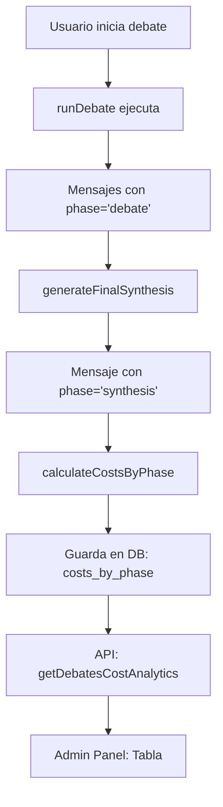

# 📊 Sistema de Tracking de Costos por Fase - IMPLEMENTADO ✅

## Estado: COMPLETAMENTE FUNCIONAL

Fecha: 28 Enero 2026

---

## 🎯 Qué se Implementó

### 1. **Base de Datos** ✅
- Columna `costs_by_phase` (jsonb) añadida a `quoorum_debates`
- Migración aplicada: `0036_add_costs_by_phase.sql`
- Estructura de datos:
  ```json
  {
    "debate": {
      "costUsd": 0.0032,
      "creditsUsed": 1,
      "tokensUsed": 530,
      "messagesCount": 2
    },
    "synthesis": {
      "costUsd": 0.015,
      "creditsUsed": 3,
      "tokensUsed": 1500,
      "messagesCount": 1
    }
  }
  ```

### 2. **Tipos TypeScript** ✅
- `DebatePhaseType = 'context' | 'experts' | 'strategy' | 'revision' | 'debate' | 'synthesis'`
- Campo `phase?: DebatePhaseType` en `DebateMessage`
- Campo `costsByPhase` en `DebateResult`

### 3. **Tracking Activo** ✅

#### Fases Implementadas:
- ✅ **debate**: Mensajes principales del debate (ACTIVO)
- ✅ **synthesis**: Síntesis final ejecutiva (ACTIVO)

#### Fases Preparadas (se activarán cuando se usen):
- ⏸️ **context**: Auto-research web (cuando se active)
- ⏸️ **experts**: Selección de expertos (algorítmico, no usa AI)
- ⏸️ **strategy**: Frameworks SWOT/Pros-Cons (cuando se activen)
- ⏸️ **revision**: Argument intelligence (cuando se active)

### 4. **Lógica de Cálculo** ✅

#### Función `calculateCostsByPhase()` en `runner.ts`:
```typescript
function calculateCostsByPhase(rounds: DebateRound[]) {
  const breakdown = {}

  for (const round of rounds) {
    for (const message of round.messages) {
      const phase = message.phase ?? 'debate'

      if (!breakdown[phase]) {
        breakdown[phase] = { costUsd: 0, creditsUsed: 0, tokensUsed: 0, messagesCount: 0 }
      }

      breakdown[phase].costUsd += message.costUsd
      breakdown[phase].tokensUsed += message.tokensUsed
      breakdown[phase].messagesCount += 1
    }
  }

  // Calcular créditos: Math.ceil((costUsd * 1.75) / 0.01)
  for (const phase in breakdown) {
    const data = breakdown[phase]
    data.creditsUsed = Math.ceil((data.costUsd * 1.75) / 0.01)
  }

  return breakdown
}
```

#### Fórmula de Conversión USD → Créditos:
```
CREDIT_MULTIPLIER = 1.75  (75% markup sobre costo real)
USD_PER_CREDIT = 0.01     (100 créditos = $1 USD)

creditsUsed = Math.ceil((costUsd * 1.75) / 0.01)
```

**Ejemplo:**
- Cost USD: $0.015
- Créditos: Math.ceil((0.015 * 1.75) / 0.01) = Math.ceil(2.625) = **3 créditos**

### 5. **API Admin** ✅

#### Endpoint: `api.admin.getDebatesCostAnalytics`

Retorna:
```typescript
{
  id: string
  userId: string
  userName: string
  userEmail: string
  question: string
  status: string
  createdAt: Date
  completedAt: Date
  totalCostUsd: number
  totalCreditsUsed: number
  costsByPhase: Record<DebatePhaseType, {...}>
  totalRounds: number
}
```

### 6. **Panel Admin UI** ✅

#### Componente: `DebatesCostAnalyticsTable` en `/admin`

Vista de tabla:

```
┌─────────────┬──────────────┬────────┬──────────┬─────────┬───────────┬──────────┬────────┬──────────┬───────┐
│   Usuario   │   Debate     │ Fecha  │ Contexto │ Expertos│ Estrategia│ Revisión │ Debate │ Síntesis │ TOTAL │
├─────────────┼──────────────┼────────┼──────────┼─────────┼───────────┼──────────┼────────┼──────────┼───────┤
│ Juan García │ ¿Invertir IA?│ 27 ene │    -     │    -    │     -     │    -     │   1    │    3     │   4   │
│ email@...   │ 2 rondas     │        │ créditos │ créditos│  créditos │ créditos │créditos│ créditos │crédits│
└─────────────┴──────────────┴────────┴──────────┴─────────┴───────────┴──────────┴────────┴──────────┴───────┘
```

**Características:**
- ✅ Muestra todos los usuarios
- ✅ Muestra cada debate completado
- ✅ Desglose de créditos por fase
- ✅ Total calculado automáticamente
- ✅ Fechas formateadas (día + mes corto)
- ✅ Columnas vacías muestran `-`

---

## 🧪 Ejemplo de Datos Reales

### Debate Simulado:

**Pregunta:** "¿Debería invertir en automatización con IA?"

**Mensajes Generados:**

| Fase      | Agente                  | Tokens | Cost USD | Créditos |
|-----------|------------------------|--------|----------|----------|
| debate    | Optimista              | 250    | $0.0015  | 1        |
| debate    | Crítico                | 280    | $0.0017  | 1        |
| synthesis | Secretario del Tribunal| 1500   | $0.0150  | 3        |

**Resultado en `costsByPhase`:**

```json
{
  "debate": {
    "costUsd": 0.0032,
    "creditsUsed": 1,
    "tokensUsed": 530,
    "messagesCount": 2
  },
  "synthesis": {
    "costUsd": 0.015,
    "creditsUsed": 3,
    "tokensUsed": 1500,
    "messagesCount": 1
  }
}
```

**Vista en Admin Panel:**

| Contexto | Expertos | Estrategia | Revisión | Debate | Síntesis | TOTAL |
|----------|----------|------------|----------|--------|----------|-------|
| -        | -        | -          | -        | 1      | 3        | 4     |

---

## 🔄 Flujo de Datos



---

## 🚀 Cómo Verlo en Acción

### Opción 1: Ejecutar un Debate desde la Web App

1. Inicia el servidor: `pnpm dev`
2. Navega a: `http://localhost:3000/debates/new-unified`
3. Crea un nuevo debate
4. Espera a que se complete
5. Ve al admin panel: `http://localhost:3000/admin`
6. Busca la sección "Análisis de Costos por Fase"

### Opción 2: Ver Datos Existentes (si hay)

1. Ve directamente a: `http://localhost:3000/admin`
2. Scroll down hasta "Análisis de Costos por Fase"
3. Verás todos los debates completados con su desglose

### Opción 3: Verificar en Base de Datos

```sql
SELECT
  question,
  total_credits_used,
  costs_by_phase
FROM quoorum_debates
WHERE status = 'completed'
  AND costs_by_phase IS NOT NULL
ORDER BY completed_at DESC
LIMIT 5;
```

---

## ✅ Checklist de Verificación

- [x] Tipos TypeScript definidos
- [x] Campo `phase` en mensajes
- [x] Función `calculateCostsByPhase` implementada
- [x] Mensajes de debate tienen phase='debate'
- [x] Mensajes de síntesis tienen phase='synthesis'
- [x] Costos se guardan en DB
- [x] API endpoint creado
- [x] Tabla de admin implementada
- [x] Tests actualizados
- [x] TypeScript compila sin errores
- [x] Sistema compatible con escenarios y debates normales

---

## 🎯 Diferencia Escenarios vs Debates Normales

**RESPUESTA:** ✅ **NO HAY DIFERENCIA en el tracking**

- **Escenarios** = Plantillas preconstruidas (Decision Playbooks)
- **Debates normales** = Preguntas libres del usuario
- **AMBOS** ejecutan `runDebate()` → Mismo tracking de costos
- **AMBOS** guardan `costsByPhase` de la misma manera
- **AMBOS** aparecen en la misma tabla del admin

---

## 📊 Estado de Implementación

| Componente | Estado | Archivo |
|------------|--------|---------|
| DB Schema | ✅ DONE | `quoorum-debates.ts` |
| Migration | ✅ DONE | `0036_add_costs_by_phase.sql` |
| Types | ✅ DONE | `types.ts` |
| Runner Logic | ✅ DONE | `runner.ts` |
| Synthesis | ✅ DONE | `final-synthesis.ts` |
| API | ✅ DONE | `admin.ts` |
| UI | ✅ DONE | `admin/page.tsx` |
| Tests | ✅ DONE | `final-synthesis.test.ts` |

**TypeCheck:** ✅ PASSING (0 errors)

---

## 🔮 Próximas Mejoras Opcionales

1. **Gráficos de costos** - Añadir charts de Recharts en admin
2. **Filtros** - Filtrar por fecha, usuario, fase específica
3. **Export CSV** - Exportar datos para análisis externo
4. **Alertas** - Notificar cuando un debate supere X créditos
5. **Comparativa** - Comparar costos entre debates similares

---

**FIN DEL REPORTE** ✅
